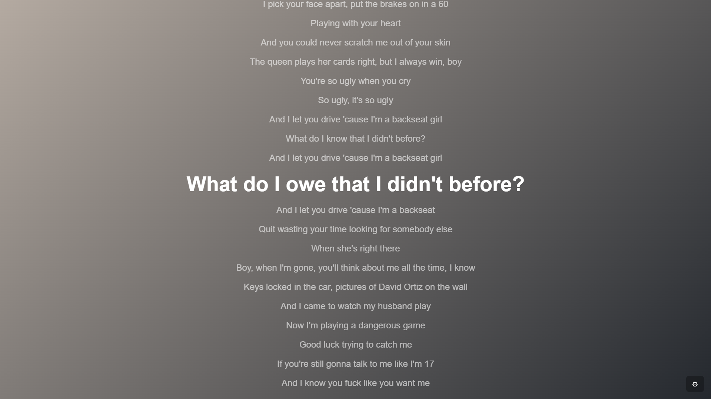
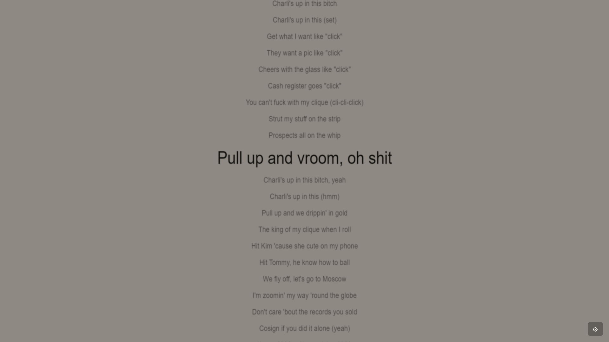

  
# nullyrics 🎶✨

nullyrics is a live wallpaper that displays your currently playing spotify lyrics. it syncs with your spotify account and shows real-time lyrics with custom themes, dynamic backgrounds, and zoom controls.

## overview

nullyrics connects with your spotify account to show the lyrics of your current track. the app supports:
- real-time synchronized lyrics
- custom css themes for artist, album, or individual tracks
- dynamic backgrounds generated from the album cover if no custom css is found
- zoom controls for adjusting text size and spacing
- a simple login process via oauth with pkce

## folder structure

```
project-root/
├── index.html              // main application html file.
├── launch.bat              // bat script to launch the local server.
├── README.md               // this file.
├── images/                 // folder for images and screenshots.
│   ├── banner.png          // banner image.
│   ├── screenshot1.png     // example screenshot.
│   └── screenshot2.png     // another screenshot.
└── styles/                 // folder for custom css.
    ├── artist/             // custom styles for artists.
    │   └── acdc/           // for artist "ac/dc" (folder name: "acdc")
    │       └── style.css   // custom css file for this artist.
    ├── album/              // custom styles for albums.
    │   └── back-in-black/  // for album "back in black" (folder name: "back-in-black")
    │       └── style.css   // custom css file for this album.
    └── single/             // custom styles for individual tracks.
        └── dont-stop/      // for the single "don't stop" (folder name: "dont-stop")
            └── style.css   // custom css file for this single.
```

## setup instructions

1. **clone the repository**

   open a terminal and run:
   
   ```bash
   git clone https://github.com/yourusername/nullyrics.git
   cd nullyrics
   ```

2. **run the local server**

   - on windows: double-click the `launch.bat` file.
   - alternatively, in a terminal run:
   
   ```bash
   python -m http.server 8000
   ```
   
   the app will be available at [http://localhost:8000](http://localhost:8000).

3. **configure wallpaper engine**

   - open wallpaper engine.
   - create a new wallpaper using a url as the source.
   - set the wallpaper url to:
   
     ```
     http://localhost:8000/
     ```
     
   the live wallpaper will load and update automatically.

4. **login & enjoy**

   - click the **login with spotify** button and follow the prompts to authorize the app.
   - the login process is quick and typically only requires a couple of clicks.
   - enjoy your live wallpaper displaying your spotify lyrics.

## customization

- **custom css themes:**  
  when a new track plays, the app logs the expected custom css folder names (using a sanitized version of the artist, album, and track names). use these names for your subfolders under `styles/artist`, `styles/album`, and `styles/single` to apply your custom css.

- **debug panel:**  
  the debug panel is hidden by default; press the **d** key to toggle it and see logs, including the expected folder names for your custom css.

## screenshots

  


## license

this project is licensed under the [mit license](LICENSE).
